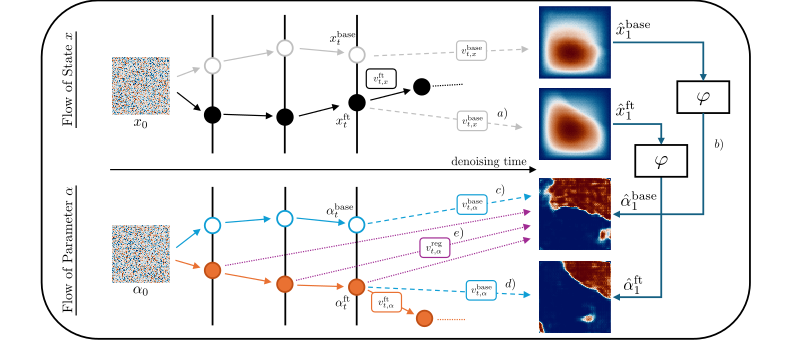
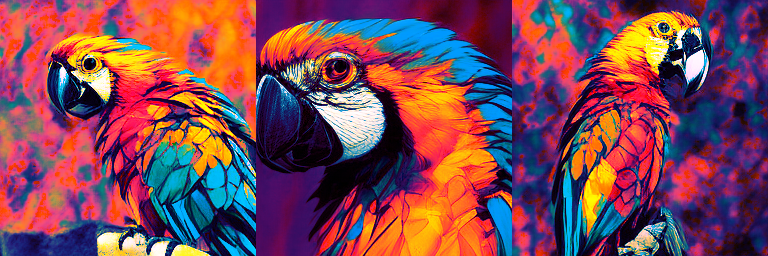

# [ICLR 2026] PCFT — Physics-Constrained Fine-Tuning of Flow-Matching Models for Generation and Inverse Problems

**Authors:** Jan Tauberschmidt, Sophie Fellenz, Sebastian J. Vollmer, Andrew B. Duncan


[](https://arxiv.org/abs/2508.09156)


<p align="center">
  
</p>

## Paper

***Abstract:*** We present a framework for fine-tuning flow-matching generative models to enforce
physical constraints and solve inverse problems in scientific systems. Starting
from a model trained on low-fidelity or observational data, we apply a differentiable
post-training procedure that minimizes weak-form residuals of governing
partial differential equations (PDEs), promoting physical consistency and
adherence to boundary conditions without distorting the underlying learned distribution.
To infer unknown physical inputs, such as source terms, material parameters,
or boundary data, we augment the generative process with a learnable
latent parameter predictor and propose a joint optimization strategy. The resulting
model produces physically valid field solutions alongside plausible estimates
of hidden parameters, effectively addressing ill-posed inverse problems in a datadriven
yet physics-aware manner. We validate our method on canonical PDE problems,
demonstrating improved satisfaction of physical constraints and accurate
recovery of latent coefficients. Further, we confirm cross-domain utility through
fine-tuning of natural-image models. Our approach bridges generative modelling
and scientific inference, opening new avenues for simulation-augmented discovery
and data-efficient modelling of physical systems.

***Key contributions:***
- **Post-training enforcement of physical constraints.**  
  Fine-tunes a pretrained flow-matching model by tilting the generative distribution toward PDE-consistent samples using **weak-form PDE residuals**, improving physical validity while preserving diversity.

- **Adjoint-Matching fine-tuning with theoretical grounding.**  
  Builds on **Adjoint Matching** to cast reward-based fine-tuning as a **stochastic optimal control** problem, enabling stable, low-variance fine-tuning for physics-based rewards.

- **Joint generation for inverse problems.**  
  Introduces a **joint evolution** of states and latent physical parameters via an inverse predictor and an auxiliary parameter flow, enabling generation of **solution–parameter pairs** without requiring paired training data.

<table>
  <tr>
    <td align="center" width="50%">
      
    </td>
    <td align="center" width="50%">
      
    </td>
  </tr>
</table>
<p align="left">
  <sub>
    <strong>Figure:</strong> Extension of our approach to natural images - here, to hidden parameter corresponds to a color transform.
    Fine-tuning of LFM model on <em>macaw</em> class using prompt
    “close-up Pop Art of a macaw parrot”, comparing <em>vanilla</em> Adjoint Matching (left) with our joint approach (right).
  </sub>
</p>

***Cite as:*** 

```latex
@inproceedings{
  tauberschmidt2026physicsconstrained,
  title={Physics-Constrained Fine-Tuning of Flow-Matching Models for Generation and Inverse Problems},
  author={Jan Tauberschmidt and Sophie Fellenz and Sebastian Josef Vollmer and Andrew B. Duncan},
  booktitle={The Fourteenth International Conference on Learning Representations},
  year={2026},
  url={https://openreview.net/forum?id=khBHJz2wcV}
}
```

## Repository Structure

- `data/`  
  Scripts for dataset generation (e.g., PDE simulators, sampling routines, corruption/noise models).  
  Look for `generate_*.py` scripts; these reproduce the datasets used in the paper.

- `models/`  
  Models and backbones used.

- `residuals/`  
  PDE residual definitions (weak/strong as implemented) and reward functions (including the PickScore-based objective used for the natural-image experiment).

- `training/`  
  Trainer classes and main entrypoints for pretraining and fine-tuning.  
  Example configurations are provided in:
  - `training/configs/`

  These configs match the paper’s experimental setups, but do not provide full sweeps over all configuration for the lambda hyperparameters.

---

## Installation

### Environment

For reproducibility, we used:

- **Python:** 3.12.3  
- **CUDA:** 12.8  
- **Dependencies:** all required Python package versions are listed in `requirements.txt`

### Setup

```bash
python -m venv .venv
source .venv/bin/activate

pip install --upgrade pip
pip install -r requirements.txt
